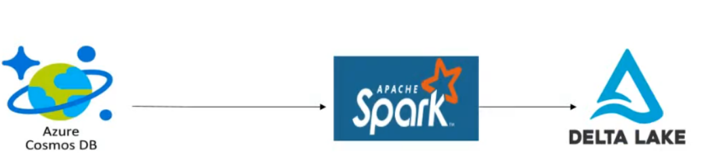

## Aim :

The objective of this project is to construct a spark streaming pipeline, utilizing the
capabilities of Azure Synapse Analytics and Azure Cosmos DB. The pipeline will
incorporate the implementation of window functions, specifically focusing on two types:
tumbling window functions and sliding window functions. These window functions play a
crucial role in data processing and analytics by facilitating calculations on specific
subsets of data. Additionally, the project will involve working with joins to combine
relevant data from different sources. Furthermore, the project will explore the creation of
logic apps, enabling the configuration of email alerts for specific events or conditions. By
encompassing these components, the project aims to showcase the integration of AzureSynapse Analytics and Azure Cosmos DB, as well as the utilization of window functions,
joins, and logic apps for comprehensive data analysis and processing.

## Tech Stack
* Language: Python, SQL
## Package: PySpark
* Services: Azure Blob Storage (ADLS Gen2), Azure Synapse Analytics, Logic Apps,
Azure Cosmos DB